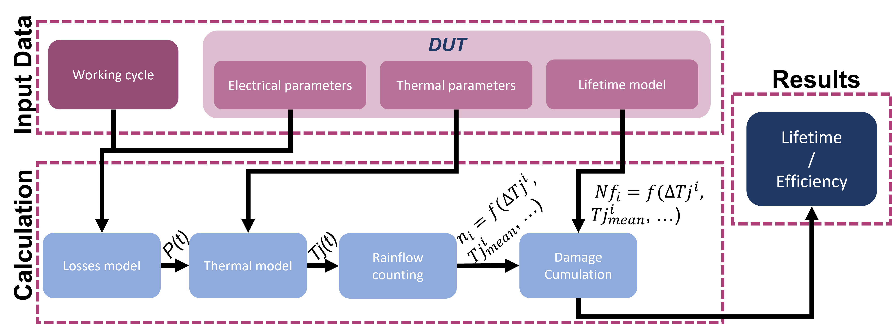
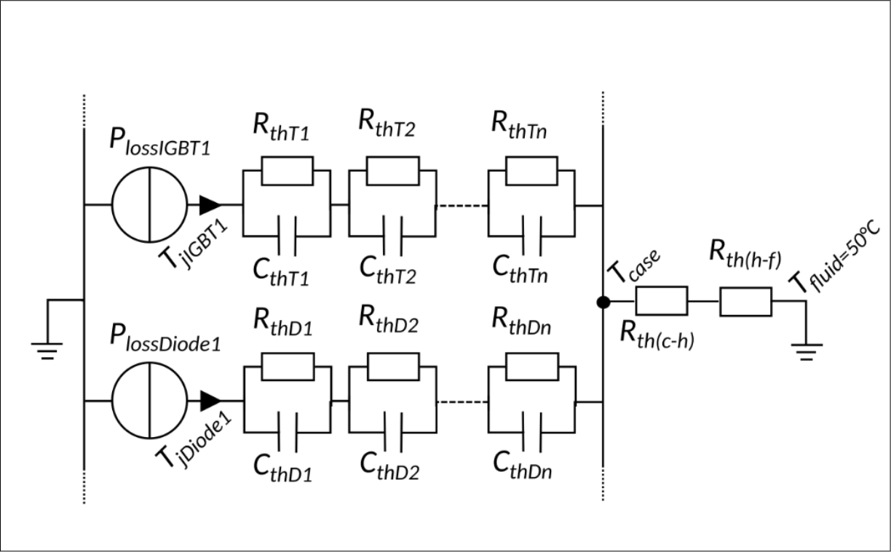

# Summary
Power electronic systems rely heavily on the performance and reliability of switches in power electronics. 
The accurate analysis of these components is crucial for designing efficient and durable systems. 
This article presents a software tool developed to address the need for reliability analysis of power electronics components.
PowDevLif aims to predict the operational lifetime of power electronics switches (the output is the number of times the DUT can make the operating cycle and the efficiency).
It includes the calculation of losses and temperature rise 
which is the factor that causes component ageing.
The method used to determine the number of cycles remaining is described in several publications in the literature [@7837397 ;@Infineon ;@7793633 ;@vehicles2030022].
However, to the best of the authors' knowledge, there is no open-source python package for using the method.

# Statement of need
PowDevLif is a python package to estimate the lifetime of a power device with the use of an electric, a thermal and a power cycling model.

\autoref{fig:example} shows the general structure of the method. First, the input data are defined, represented by the stresses applied to the product (working cycle) and the physics of the DUT (electrical parameters, thermal parameters and its lifetime model). Secondly, the input data are implemented in a physical loss model, enabling the DUT's losses to be calculated over an operating cycle. The losses are used to calculate the temperature rise using a thermal model. A counting algorithm determines the temperature cycles undergone by the DUT, which are then compared with a cumulative damage law to determine the number of times the DUT can perform the input duty cycle.

PowDevLif is implemented with flexibility and adaptability in mind.
The librairie is modular in design, making it easy to add new features and adapt 
analysis to specific configurations. The first version of the librairy is implemented for a specific topology, it has
to be modified to estimate the lifetime of a specific component, by changing the DUT or the operating cycle or the various models and methods.
The library is initially coded for a topology of an IGBT and a diode in an inverter. The input operating cycle is constructed with RMS current, 
phase shift and modulation index as a function of time. The different models, methodes and laws used are shown below:

1. The loss model is based on one inverter arm controled with a sinusoidal 
reference in linear scalar modulation without taking into account temperature 
feedback loops on electrical parameters[@SEMIKRON]. This choice was made because 
of the simplicity and ease of implementation.

$$P_{cond,IGBT} = (\frac{1}{2\pi}+\frac{m\cdot \cos\Phi}{8})\cdot V_{CE0}\cdot \sqrt{2}\cdot I+(\frac{1}{8}+\frac{m\cdot \cos\Phi}{2\pi})\cdot R_{CE} \cdot 2\cdot I^2$$

$$P_{com,IGBT} = f_{sw} \cdot E_{on+off}\frac{\sqrt{2}}{\pi}\frac{I}{I_{ref}}(\frac{V_{dc}}{V_{ref}})^{K_{V,IGBT}}$$

$$P_{cond,diode} =(\frac{1}{2\pi}+\frac{m\cdot \cos\Phi}{8})\cdot V_{f0}\cdot \sqrt{2}\cdot I+(\frac{1}{8}+\frac{m\cdot \cos\Phi}{2\pi})\cdot R_{f} \cdot 2\cdot I^2$$

$$P_{com,IGBT} = s_{sw}\cdot E_{rr}\frac{\sqrt{2}}{\pi}(\frac{I}{I_{ref}})^{K_{I,diode}}(\frac{V_{dc}}{V_{ref}})^{K_{V,diode}}$$

$P_{cond}$ represents conduction losses and $P_{com}$ switching losses. $K_{V,IGBT}$, $K_{V,diode}$ and $K_{I,diode}$ are voltage and current dependence coefficients.

2. The thermal model is Foster-type, \autoref{fig:example2}, chosen for its ability to describe 
thermal behavior of the system. Other models, such as the Cauer, 
could have been used [@6631903].

3. With regard to lifetime model, an empirical law based on data from accelerated cycling was used, 
in particular the Coffin-Manson and Arrhenius model [@9316255].
It takes into account the impact of temperature rise and the mean temperature. This choice was 
made because of the model's capacity to effectively predict component remaining useful life, thanks to the use of the rainflow method.

$$Nf = A\cdot\Delta Tj^\alpha\cdot\exp(\frac{Ea}{k\cdot Tjmean})$$

$Nf$ represents the maximum number of cycles, $\Delta Tj$ the temperature rise and $Tjmean$ the average temperature. 

4. The rainflow method is a thermal cycle counting algorithm that produces 
a matrix containing the amplitude of the variations $∆Tj$ experienced 
by the module and the number of associated cycles [@9316255].

5. Finally, a cumulative damage law can be used to determine the
system lifetime. The linear damage accumulation law
is proposed [@9316255], and is the most widely used law for estimating
remaining useful life, but assumes the strong hypothesis of a linear
linear damage accumulation.
$$D=\sum_{i=1}^{n}\frac{n_i}{Nf_i}$$

$D$ represents the damage sustained over the operating cycle, $n_i$ the number of cycles undergone for a thermal cycle, $Nf_i$ the maximum number of cycles of the DUT for the same thermal cycle and $n$ the number of thermal cycle. 

This library, developed for the analysis of IGBT and diode components, 
is a valuable tool for engineers and researchers working in the field of power electronic systems. 
It enables in-depth evaluation of component lifetime, optimization of operating parameters and improved energy efficiency. 
This software contributes to the advancement and development of electronic technologies, 
by providing a tools for the reliability and the long-lasting systems.

# References
